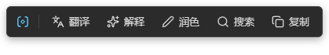
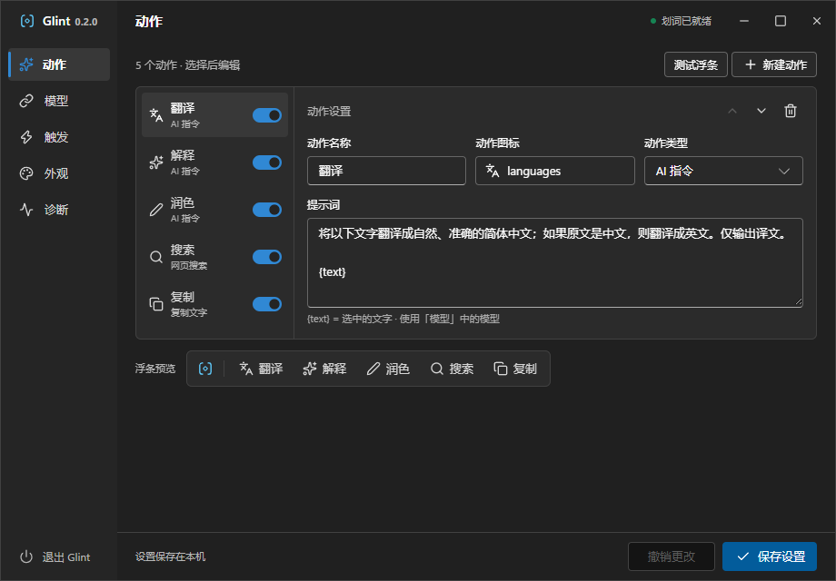
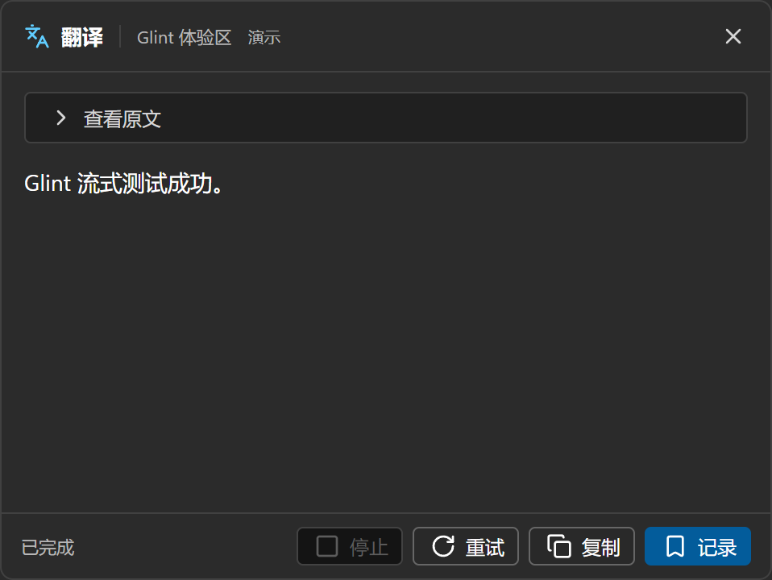

# Glint

**Select text. Take action.**

[简体中文](README.md) · **English**

Glint is a customizable text selection assistant for Windows and Linux. Translate while reading, polish a sentence while writing, or search from a compact toolbar without switching between apps.

[Download Glint](https://github.com/yshsharke/Glint/releases) · [Report an issue](https://github.com/yshsharke/Glint/issues) · [Changelog](CHANGELOG.md)

Select text to bring everyday actions within reach. The screenshots below preview the 0.2.0 interface; see Releases for available downloads.

## Download and install

For **Windows 10 / 11 x64**. Downloads include the runtime; no Node.js, Python or developer tools are required.

Choose a version on [Releases](https://github.com/yshsharke/Glint/releases) and expand **Assets**:

| File | Choose this to… |
| --- | --- |
| `Glint-VERSION-windows-x64-portable.exe` | Run without installing. Save it in a folder and double-click it. Startup briefly extracts the application. |
| `Glint-VERSION-windows-x64-setup.exe` | Choose an installation folder, launch from the Start menu and uninstall through Windows Settings. |

GitHub's **Source code** archives are for development, not ready-to-run downloads. Releases are currently unsigned previews, so Windows may display an “unknown publisher” warning. Download from this repository's Releases page; use the accompanying `SHA256SUMS.txt` to verify the file.

**Portable means no installation; settings and saved records still live in the current Windows user's AppData folder. They do not travel with the exe.** Both editions share the same data, and only one Glint instance runs per user.

Linux x64 is available as a source-build preview on X11 and compatible Wayland desktops, including KDE Plasma and Hyprland. Existing downloads remain Windows-only. See [Linux setup and limitations](docs/LINUX.md) for builds and local AppImage/tar packaging.

## Get started

1. Open **模型 (Model)**, enter your provider's API URL, model name and API key, then click **保存设置 (Save settings)**. Glint supports OpenAI-compatible APIs and local model services. It does not include a model subscription or API credits.
2. Select text in another application to show the toolbar, or press **Ctrl + Alt + G** to capture the current selection. Wayland defaults to shortcut mode and may ask you to authorize the shortcut.
3. Choose **翻译 (Translate)** or **润色 (Polish)** to open a result card. Search works without a model connection.

Click the Glint icon on the toolbar to open settings. Closing settings keeps Glint running in the system tray. Left-click the tray icon to reopen settings; right-click for **打开设置 (Open settings)**, **停止划词 / 启用划词 (Disable / Enable selection)** and **退出 (Quit)**. You can also quit from the bottom-left corner of settings.

## Make it yours

- **Your own actions.** Choose **指令 (Instruction)** or **搜索 (Search)**, edit prompts and add up to 12 actions. Reorder, enable or hide them. New actions need a display name and a unique English name (such as Summary / summary). The English name is shown only during creation and stays fixed after saving to identify the database.
- **A consistent icon library.** Browse and search the built-in Lucide icons, available offline.
- **Control when it appears.** Use automatic selection or a keyboard shortcut. Windows supports app exclusions, accessibility capture, direct copy, or copy when accessibility finds no text. Copy capture restores the clipboard afterward; Linux capabilities are described below.
- **A compact Windows-style interface.** Follow the system theme or choose light/dark, with four accent colors and two toolbar densities.

Linux reads PRIMARY selections only; copy capture is unavailable. Wayland cannot identify or exclude source apps, and GNOME Wayland is unsupported by the current backend. Glint uses XWayland for toolbar placement while capturing native Wayland selections. Automatic capture on Wayland observes all applications; use the toolbar's close button when global dismissal events are unavailable.

Manage actions on one page: adjust their names, icons, types and prompts, then check their order in the toolbar preview below.

Use `{text}` in an action prompt to insert the selected text. For example:

> Rewrite this passage in clear, natural English. Preserve its meaning and return only the revised text: {text}

## Work with the result

Results stream into a separate card. Stop a response, retry it or copy it with one click. The header shows the action and source app; expand the original text to review it.

Every **指令 (Instruction)** action—including Translate, Explain, Polish and your own actions—offers **记录 (Save)** to store the original text, result and source process in its own local database. Saving again after a retry updates the same record. In **历史 (History)**, switch between actions to browse records by date. The original and result appear in stacked panes that scroll independently; use the header buttons to copy either text or delete the current record. Disabled actions remain available in History. Search is not yet supported.

## Your data

Text is sent to your configured model service only when you invoke an AI action. Search opens Google in your browser. Glint contains no telemetry and does not automatically save selected text as a record.

On Windows, API keys are encrypted using system protection. Manually saved text and results use unencrypted local SQLite databases. Settings are in `%APPDATA%\Glint`; records and logs are in `%LOCALAPPDATA%\Glint`. See the [privacy details](docs/PRIVACY.md) (Chinese).

On Linux, API keys require an unlocked system keyring; insecure plaintext fallback is refused. Settings, records and logs follow XDG directories, defaulting to `~/.config/Glint`, `~/.local/share/Glint/data` and `~/.local/state/Glint/logs`.

## Common questions

**No toolbar after selecting text?** Keep the pointer in the window containing the selection and try `Ctrl + Alt + G`, then check excluded apps in **触发 (Triggers)** and the engine status in **诊断 (Diagnostics)**. Some PDFs, terminals, protected or elevated windows do not expose accessible text. OCR is not supported, and selection cannot be guaranteed in every app.

**Model connection failed?** Check the API URL, port, model name and key. A local service may use `http://` instead of `https://`. There is no built-in proxy configuration, and Windows system proxy settings are not guaranteed to apply.

**How do I update?** Download the new version manually. Quit Glint completely, then run the new installer or replace the portable exe. Settings and records remain available under the same Windows account. Automatic updates are not implemented.

**How do I uninstall?** Remove the installed edition through Windows Settings. For portable, quit and delete the exe. Both retain personal data; see the [data removal instructions](docs/PRIVACY.md#删除与备份) if you also want to erase it.

The app interface is currently Chinese. macOS, ARM64, OCR, in-place replacement and multi-turn chat are not supported yet. A resident-memory budget has not been established.

## Open source

Glint is [MIT licensed](LICENSE). Thanks to [selection-hook](https://github.com/0xfullex/selection-hook), [Electron](https://github.com/electron/electron), [Fluent UI](https://github.com/microsoft/fluentui), [React](https://react.dev) and [Lucide](https://lucide.dev). Cherry Studio informed selection architecture decisions; see [implementation references](docs/REFERENCES.md) and [third-party notices](THIRD_PARTY_NOTICES.md).

To contribute, read [CONTRIBUTING](CONTRIBUTING.md). For security issues, see [SECURITY](SECURITY.md).
